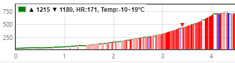
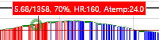
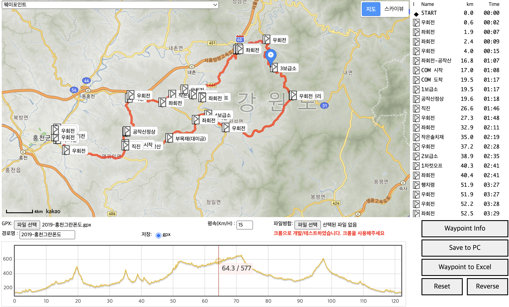

[](https://hits.seeyoufarm.com)

## 2024.08.01
* database 변경, mysql -> postgresql
* 기존에 운영하던 v1에서 mysql을 postgresql로 변경하고 v2에서는 postgresql을 사용

## 2024.06.05
* mysql mb4 설정, 맥에서 한글 풀어쓰기 문제 확인 필요 --> mysql 사용하지 않음
```sql
SHOW VARIABLES LIKE 'character_set%';
SHOW VARIABLES LIKE 'collation%';
alter database newdb CHARACTER SET utf8mb4 COLLATE utf8mb4_unicode_ci;
ALTER TABLE mytable CONVERT TO CHARACTER SET utf8mb4 COLLATE utf8mb4_unicode_ci;

String url = "jdbc:mysql://localhost:3306/your_database_name?useUnicode=true&characterEncoding=utf8mb4";

```

## minio
* cpu 리소스가 부족하여 minio client을 사용하여 aws s3로 변경(2024.06.05)
* minio를 더이상 사용하지 않음
```shell
wget https://dl.min.io/server/minio/release/linux-amd64/minio
chmod +x minio
화
sudo mv minio /usr/local/bin/

sudo useradd -r minio-user -s /sbin/nologin
sudo chown minio-user:minio-user /usr/local/bin/minio

sudo mkdir /etc/minio
sudo chown minio-user:minio-user /etc/minio

sudo nano /etc/systemd/system/minio.service

[Unit]
Description=MinIO
Documentation=https://docs.min.io
Wants=network-online.target
After=network-online.target

[Service]
User=minio-user
Group=minio-user
WorkingDirectory=/usr/local/
ExecStart=/usr/local/bin/minio server /home/bitnami/minio/data --console-address ":9000"
Restart=always
LimitNOFILE=65536
EnvironmentFile=-/etc/default/minio

[Install]
WantedBy=multi-user.target

```

## 2024.05.28
* gpx, tcx 파일을 업로드하면 경로정보를 DB에 저장
* vworld 3d view 기능추가
* minio(aws s3) 사용하여 파일 저장
  * yml 추가
```yaml
minio:
  url: http://localhost:9000
  accessKey: 
  secretKey: 
  bucketName: was
```
  * Windows
  * minio server X:\home\mnt
  * MAC
```text
server
brew install minio/stable/minio
MINIO_ROOT_USER=admin MINIO_ROOT_PASSWORD=password minio server /mnt/data --console-address ":9001"

client
brew install minio/stable/mc
mc alias set myminio/ http://MINIO-SERVER MYUSER MYPASSWO
```

## 2024.04.30
* 깔딱고개: 심박이 있는 경우 최고점 표기
* 

## 2024.04.29
* Garmin connect에서 받은 gpx, tcx에 있는 확장정보를 조회하고 저장시 사용하지 않음
  * gpx
  ```xml
        <extensions>
          <ns3:TrackPointExtension>
            <ns3:atemp>17.0</ns3:atemp>
            <ns3:hr>97</ns3:hr>
          </ns3:TrackPointExtension>
        </extensions>
  ```
  * tcx
  ```xml
              <HeartRateBpm>
              <Value>97</Value>
            </HeartRateBpm>
  ```
* 거리, 고도, 심박, 온도(tcx는 없음)
* 
* Garmin Tempe(온도계): 산에서 온도가 궁금할때 많은 도움도 되고 기록이 함께 되어 편리함
  * https://www.garmin.com/en-US/p/107335

## 2024.04.15
### Database sql 로그 포맷 변경
* jpa의 format_sql, show_sql을 사용하지 않고 p6spy를 사용하여 sql로그를 출력
```sql
INFO 118324 --- [nio-9090-exec-8] p6spy                                    : OperationTime : 4ms|
    select
        sharecours0_.fileid as fileid1_2_,
        sharecours0_.distance as distance2_2_,
        sharecours0_.downcnt as downcnt3_2_,
        sharecours0_.elevation as elevatio4_2_,
        ...
    from
      tcxsharecourses sharecours0_
    where
      sharecours0_.filehash='8a68fb2ecc4ae72ab097dc7fff0b9296'
```
### post, get 요청정보 로그
* post는 한번 읽으면 사라지기 때문에 로그를 남기기 위해 filter를 사용하여 로그를 남김
* LoggerAspect.java 참조


## 2024.04.14
### Database 사용
* mysql을 사용하고 있고 운영정보이므로 아래 yml에서 적절히 수정해야 함
* yml파일은 실제 운영정보가 있어 첨부되지 않음
  * application-local.yml
  * application-prod.yml

### Deploy 
* deploy.sh 추가, git에 파일을 추가하지 않고 설명만 추가
```shell
#!/bin/bash

mvn clean package -Dmaven.test.skip=true -f pom.xml

SERVER_USER=bitnami
SERVER_IP=serveripv4
SERVER_PATH=server_path
LOCAL_PATH=./target/giljabi-1.0.0.jar
GILJABI_PEM=ssh 접속을 위한 key파일.pem

ssh -i $GILJABI_PEM $SERVER_USER@$SERVER_IP << EOF
  echo "Attempting to gracefully stop Spring Boot..."
  # Assuming usage of Spring Boot Actuator to shutdown
  curl -X POST localhost:8080/actuator/shutdown

  echo "Executing kill script..."
  ./kill.sh
  if [ \$? -ne 0 ]; then
    echo "Failed to execute kill script. Exiting..."
    exit 1
  fi
  echo "Kill script executed successfully."
EOF

if [ $? -eq 0 ]; then
  echo "Deployment script completed successfully."
else
  echo "Deployment failed. Please check the logs."
fi

echo "Deploying to $SERVER_IP"
#scp -i $GILJABI_PEM $LOCAL_PATH $SERVER_USER@$SERVER_IP:$SERVER_PATH
# 파일이 큰 경우 업로드 시간이 오래 걸리므로 rsync 사용하여 진행사항을 볼 수 있음
rsync -avh --progress -e "ssh -i $GILJABI_PEM" $LOCAL_PATH $SERVER_USER@$SERVER_IP:$SERVER_PATH/

ssh -i $GILJABI_PEM $SERVER_USER@$SERVER_IP << EOF
  echo "Changing directory to $SERVER_PATH..."
  cd $SERVER_PATH
  ./run.sh
EOF
```

### server shell files
* run.sh
```shell
#!/bin/sh

APP_NAME=giljabi-1.0.0.jar

PID=$(ps -ef | grep $APP_NAME | grep -v grep | awk '{print $2}')
if [ -z "$PID" ]; then
    echo "Application is not running."
else
    echo "Killing application with PID: $PID"
    kill -9 $PID
    echo "Application terminated."
fi

echo "Start giljabi application"
nohup java -jar -Dspring.profiles.active=prod -Djava.net.preferIPv4Stack=true giljabi-1.0.0.jar > /dev/null 2>&1 &
```

* kill.sh
```shell
#!/bin/sh

APP_NAME=giljabi-1.0.0.jar

PID=$(ps -ef | grep $APP_NAME | grep -v grep | awk '{print $2}')
if [ -z "$PID" ]; then
    echo "Application is not running."
else
    echo "Killing application with PID: $PID"
    kill -9 $PID
    echo "Application terminated."
fi

```


## 2024.04.05
### 경사도 정보 추가
* 완만하게 보이지만 경사도가 매우 높은 경우가 있어서 경사도 정보를 툴팁과 차트에 붉은색으로 추가
* 지형정보, POI정보(편의점, 숙박, 카페, 식당) 조회 정보 추가
* package 빌드시 application-local.yml 제외 
  * mvn clean package -f pom.xml -DskipTests
  * java -jar -Djava.net.preferIPv4Stack=true -Dspring.profiles.active=prod giljabi-1.0.0.jar

---

## 2024.03.25
### h2 db 사용삭제
#### giljabi.html 웨이포인트 편집/경로 검색
* https://giljabi.tistory.com/27
* trkseg가 2개 이상이 있는 경우, 이어서 그려주고 저장시 1개로 저장

#### editor.html 경로그리기
* https://giljabi.tistory.com/28
* "한국등산트레킹지원센터_산림청 100대명산" gpx를 배경으로 두고 원하는 경로를 그릴 수 있게 개선
  * 출처: https://www.data.go.kr/data/15098177/fileData.do?recommendDataYn=Y
  * forest100.zip 압축파일 내용을 forest100 폴더에 넣어줌
* 개인적인 경로를 배경을 두고 원하는 경로를 그릴 수 있게 개선

---

### [http://giljabi.kr](http://giljabi.kr/) 초기버전은 AWS Light sail를 사용하고 있으며 아래에 설명이 있습니다.
* [AWS Lightsail apache tomcat 설치 그리고 운영](https://gpxtcx.tistory.com/11)
* [gpx2tcx 변환/병합과 웨이포인트 작성 웹 소개](https://gpxtcx.tistory.com/3)
* [giljabi 시작과 현재 소개글](https://gpxtcx.tistory.com/13)

### [https://giljabi.tistory.com/](https://giljabi.tistory.com/) 소스공유 설명 블로그
### [https://gpxtcx.tistory.com/](https://gpxtcx.tistory.com//) 경로공유 블로그


## since 2018.10.26
블로그 첫글(https://gpxtcx.tistory.com/1)에도 있습니다먼, 개인적으로 불편함이 시작이었습니다.
가민520 사용하면서 제대로 사용하려면 tcx/gpx등의 파일을 만들어서 사용해야 하는데 가민에서 제공하는 것은 
너무 불편하고 해외 사이트에서 제공하는 것은 한글문제가 있더군요

그래서 파일을 열어보니 그냥 xml 파일이라 이거 한번 해볼까해서 하다보니 웹페이지도 만들고
구글 애드센스, 카카오애드핏도 해보고 다양한 경험을 하게 되었습니다. 광고는 있는데 아직 수익 전환기준이 언제 될지 까마득합니다.

개인적으로 사용하던것을 공개를 하려니 정리가 잘 안되지만, 한번은 정리가 필요해서 정리도 하고 공유하게 되었습니다.

진행 예정인 부분은 UI부분에서 gpx만 업로드할 수 있는데 tcx 파일업로드 추가할 예정이고
elevation, route api 호출시 간단한 경로정보를 DB에 저장하는데 최근 유행하는 JPA를 이용하려합니다.

JPA는 트랜잭션에 특화해서 사용하면 상당히 편리해보이는데 다양한 리포팅을 위해 사용하기에는 고민이 좀 됩니다.
querydsl를 사용할수도 있겠지만, 리포팅 부분은 mybatis같은 매퍼를 사용하는게 생산성이 좋은것 같습니다.

개발 DB는 H2를 사용할 예정입니다. 실제 운영되는 DB는 mysql을 사용하고 있습니다.


현재 운영중인 [http://giljabi.kr](http://giljabi.kr)는 mysql, struts를 기반으로 개발 되었습니다.


## 로컬 환경에서 사용가능
* spring boot 기반으로 tomcat이 내장되어 있어 java(1.8 권장)만 설치되어 있으면 사용 가능합니다.
* gpx, tcx 파일 만드는 것을 javascript로 구현하여 openrouteservice apikey가 없어도 웨이포인트 작성해서 가민등에서 사용할 수 있습니다.
* api key 노출이 되면 안되는 openrouteservice, google api를 사용하는 것만 api로 작성되어 있습니다.


## openrouteservice, google elevation api
* 경로탐색을 위한 api, 구글 고도정보를 가져오는 api 사용하는 방법을 공유합니다
  나중에는 경로탐색도 구글을 사용하게 변경할 예정입니다.


## 소스 공유
### github : [https://github.com/parknamjun/giljabi](https://github.com/parknamjun/giljabi)
* 사용법 http://localhost:8080/giljabi.html
* 사용목적이 경로를 만들고 사용하는 것이 주된 용도이므로 기본에는 충실하고자 하였습니다.




### Open api 참고글
* [https://openrouteservice.org/](https://openrouteservice.org/)
* [https://github.com/GIScience/openrouteservice-docs](https://github.com/GIScience/openrouteservice-docs)
* [https://developers.google.com/maps/documentation/elevation/start](https://developers.google.com/maps/documentation/elevation/start)


### 블로그 작성글
* [지도 경로탐색 오픈API 소개(OpenRouteService)](https://gpxtcx.tistory.com/38)
* [openrouteservice api 사용](https://giljabi.tistory.com/2)

### swagger http://localhost:8080/swagger-ui.html
API 테스트 방법
1. API key 설정
* application.yml에 위 사이트에서 발급받은 key 값을 각각 넣어줍니다.
```
giljabi:
  openrouteservice:
    apikey: 1234567890.....
    directionUrl: https://api.openrouteservice.org/v2/directions/%s/json
  google:
    elevation:
      googleGetCount: 400
      apikey: ABCDEFGH..........
      elevationUrl: https://maps.googleapis.com/maps/api/elevation/json
```

2. 경로탐색
* http 파일의 내용을 참고
```
GET http://localhost:8080/api/1.0/route?start=127.01117,37.5555&target=126.99448,37.54565&direction=cycling-road
Content-Type: application/json
```   

3. 높이정보
```
POST http://localhost:8090/api/1.0/elevation
Content-Type: application/json

{
"trackPoint":[
{"lng":127.03178,"lat":37.59244},
{"lng":127.03221,"lat":37.59245},
{"lat":37.59234,"lng":127.03322},
{"lat":37.59161,"lng":127.03348},
{"lat":37.59173,"lng":127.03391},
{"lat":37.59197,"lng":127.03438},
{"lat":37.59217,"lng":127.03472},
{"lat":37.59242,"lng":127.03514},
{"lat":37.59236,"lng":127.03522},
{"lat":37.59247,"lng":127.03557},
{"lat":37.59247,"lng":127.0361},
{"lat":37.59245,"lng":127.03618},
{"lat":37.59241,"lng":127.03635},
{"lat":37.59197,"lng":127.03634}
]
}
```

## GPX & TCX 사양
* [https://en.wikipedia.org/wiki/Training_Center_XML](https://en.wikipedia.org/wiki/Training_Center_XML)
* [https://en.wikipedia.org/wiki/GPS_Exchange_Format](https://en.wikipedia.org/wiki/GPS_Exchange_Format)


## gpx
```
?xml version="1.0" encoding="UTF-8"?>
<gpx xmlns="http://www.topografix.com/GPX/1/1"
creator="giljabi"
version="1.1"
xmlns:xsd="http://www.w3.org/2001/XMLSchema"
xmlns:xsi="http://www.w3.org/2001/XMLSchema-instance">
<metadata>
<name>2019-홍천그란폰도</name>
  <link href="http://www.giljabi.kr"></link>
  <desc>giljabi</desc>
  <copyright>giljabi</copyright>
  <speed>15</speed>
</metadata>
    <!-- 웨이포인트 반복 -->
	<wpt lat="37.70807408255889" lon="127.9078544749572">
		<name>1</name>
		<sym>danger</sym>
		<time>2022-01-01T00:00:00Z</time>
	</wpt>
	<trk>
		<trkseg>
            <!-- 반복 -->
			<trkpt lat="37.70807408255889" lon="127.9078544749572">
				<ele>139.3631744384766</ele>
			</trkpt>
		</trkseg>
	</trk>
</gpx>
```

### 현재는 1개 경로만 사용합니다.
## tcx
```
<?xml version="1.0" encoding="UTF-8"?>
<TrainingCenterDatabase xmlns="http://www.garmin.com/xmlschemas/TrainingCenterDatabase/v2"
xmlns:xsi="http://www.w3.org/2001/XMLSchema-instance"
xsi:schemaLocation="http://www.garmin.com/xmlschemas/TrainingCenterDatabase/v2 http://www.garmin.com/xmlschemas/TrainingCenterDatabasev2.xsd">
<Folders>
	<Courses>
		<CourseFolder Name="giljabi.kr">
			<CourseNameRef>
				<Id>7</Id>
				<Author>Giljabi</Author>
			</CourseNameRef>
		</CourseFolder>
	</Courses>
</Folders>
	<Course>
		<CoursePoint>		<!-- 반복 -->
			<Name>START</Name>
			<Time>2022-01-01T00:00:00.000Z</Time>
			<Position>
				<LatitudeDegrees>37.708074</LatitudeDegrees>
				<LongitudeDegrees>127.907854</LongitudeDegrees>
			</Position>
			<PointType>start</PointType>
		</CoursePoint>
		<Speed>15</Speed>
		<Name>2019-홍천그란폰도</Name>
		<Lap> <!-- 시작에서 끝 지점 정보 -->
			<TotalTimeSeconds>266</TotalTimeSeconds>
			<DistanceMeters>1146</DistanceMeters>
			<BeginPosition>
				<LatitudeDegrees>37.70807408255889</LatitudeDegrees>
				<LongitudeDegrees>127.9078544749572</LongitudeDegrees>
			</BeginPosition>
			<EndPosition>
				<LatitudeDegrees>37.70419318700026</LatitudeDegrees>
				<LongitudeDegrees>37.70419318700026</LongitudeDegrees>
			</EndPosition>
			<Intensity>Active</Intensity>
		</Lap>
		<Track>
			<Trackpoint> <!-- 반복 -->
				<Time>2022-01-01T00:00:00.000Z</Time>
				<Position>
					<LatitudeDegrees>37.708074</LatitudeDegrees>
					<LongitudeDegrees>127.907854</LongitudeDegrees>
				</Position>
				<AltitudeMeters>139</AltitudeMeters>
				<DistanceMeters>0</DistanceMeters>
			</Trackpoint>
    	</Track>
	</Course>
</Courses>
</TrainingCenterDatabase>
```
### 로그설정(local)
```text
server:
  port: 9090

#mysql 설정,
spring:
  datasource:
#    url: 
#    driver-class-name: com.mysql.cj.jdbc.Driver
#    username: 
#    password: 
    url: 
    #driver-class-name: com.p6spy.engine.spy.P6SpyDriver
    driver-class-name: com.mysql.cj.jdbc.Driver #p6spy start를 사용
    username: 
    password: 
  jpa:
    properties:
      hibernate:
        dialect: org.hibernate.dialect.MySQL5InnoDBDialect
        ddl-auto: none #create, update
        #format_sql: true
        #show_sql: true
  servlet:
    multipart:
      max-file-size: 10MB
      max-request-size: 10MB
  devtools:
    restart:
      enabled: false
  thymeleaf:
    cache: false

jwt:
  #accessTokenSecret: 4RT/2hAAJmC6i2FzmezBbaCVMD9FtsuExyjaVWJ5xRA=
  accessTokenSecret: accessTokenSecret
  accessTokenExpiration: 604800000

giljabi:
  openrouteservice:
    apikey: 
    directionUrl: https://api.openrouteservice.org/v2/directions/%s/json
  google:
    elevation:
      #google elevation get api는 요청된 좌표 적절히 잘라서 8192를 넘지 않아야 한다. 400이 적당
      #400은 소스 코드에 추가하자.
      googleGetCount: 400
      apikey: 
      elevationUrl: https://maps.googleapis.com/maps/api/elevation/json
  mountain100:
    path: ./forest100
  image:
    physicalPath: /temp/giljabi/images
    urlPath: /hello/images

  xmlshare: #gpx, tcx 공유파일 경로, 삭제하지 않는 파일들...
    #path: /home/bitnami/apps/tomcat7/wasfiles/share
    path: /temp/giljabi/wasfiles/share

minio:
  url: http://localhost:9000
  accessKey: 
  secretKey: 
  bucketName: service
```